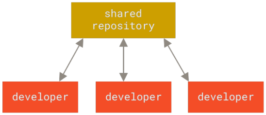
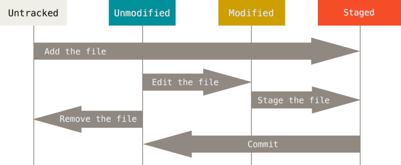

# Pro Git

## 1. Control de versiones

### 1.1 VCS

Un Sistema de Control de Versiones (VCS), registra los cambios
realizados en un archivo o conjunto de archivos a lo largo del tiempo, para
luego poder recuperar alguna versión anterior específica, si se desea.

### 1.2 Sistemas de control de versiones centralizados

Un único servidor que almacena todos los archivos versionados y desde el cuál
los desarrolladores los descargan o revisan.



*Fig. 2: Versión de control centralizado.*

Este tipo de configuración es muy dependiende del servidor; si este cae, los
desarrolladores estarán inactivos durante ese periodo, además de que puede el
servidor corromperse y perder todos los archivos.

### 1.3 Sistemas de control de versiones distribuidos

En los Sistemas de Control de Versiones Distruibuidos (DVCS), cada cliente del
servidor descarga una copia completa de los archivos, no tan solo la última
instantánea.


*Fig. 3: Versión de control distrbuido.*

Si es que llegase a ocurrir algún problema con el servidor, los archivos pueden
ser fácilmente restaurados.

### 1.4 Qué es Git?

Una diferencia principal entre otros VCS y Git es que estos gestionan sus datos
como una serie de cambios entre los archivos, también descrito como control de
versión basado en delta.


*Fig. 4: Almacenando datos como cambios a una versión base de cada archivo.*

Git gestiona sus datos como una serie de capturas de un sistema de archivos
miniatura. Cada cambio guardado es una captura de como lucen los archivos en
ese momento y una referencia a ellos.


*Fig. 5: Almacenando los datos como capturas del proyecto a través del tiempo.*

Cualquier cambio por confirmar en Git tiene que ser verificada mediante una
suma de comprobación hash SHA-1 de 40 caracteres hexadecimales calculados a
partir del contenido del archivo o la estructura del directorio, por lo tanto,
cualquier mínimo cambio es detectado por Git.

#### 1.4.1 Los tres estados de Git

Los archivos pueden estar en tres estados: modified (modificado), staged
(preparado) y committed (confirmado).

- *modified* significa que el archivo ha sido modificado pero que todavía no
  está listo para ser confirmado (committed).
- *staged* significa que el archivo modificado como tal está listo para ser
  confirmado (committed).
- *committed* significa que los datos estan almacenados de manera segura:
  existe una "captura" de ellos en la base de datos.


*Fig. 6: Working tree (directorio de trabajo), staging area (área de
preparación) y directorio Git.*


Dependiendo a su estado los archivos pueden estar en una de las tres secciones
siguientes:

- El **directorio de trabajo** es una copia de una versión del proyecto y es
  extraída de la base de datos del directorio Git para ser usada o modificada.
- El **área de preparación** o *index*, es un archivo que almacena información
  sobre lo que va a ir en la próxima confirmacion o commit.
- El **directorio Git** es la parte mas importante de Git y es donde se guardan
  los metadatos y la base de datos de objetos para el proyecto.

El flujo de trabajo en Git es la siguiente:
- Modificas archivos en el directorio de trabajo.
- agregas aquellos archivos que están listos para ser confirmados al *staging
  area*.
- Haces una confirmación o *commit* que guarda una captura de los archivos
  marcados como preparados en el directorio Git de manera permanente.

Una manera complementaria de ver este proceso en Git es la siguiente:



*Fig. 6.1: El ciclo de vida de los archivos en Git.*

En este caso, se tiene en consideración que los archivos, en un primer momento,
tendrán un estado *untracked* cuando se inicia el proyecto y que al agregarlos,
pasarán directamente al área de preparación (staged).

## 2. Fundamentos Git

### 2.1 Configuraciones

Git tiene una herramienta llamada `git config` que permite mostrar o
configurar variables que controlan todos los aspectos de como Git se muestra y
funciona. Estas variables pueden ser almacenadas en diferentes lugares:
- archivo *[path]/etc/gitconfig*: la configuración es aplicada a cada usuario y
  repositorios de usuario en el sistema, por lo tanto, es necesario tener
  privilegios de super usuario. La configuración es mediante 
  `git config --system`.
- archivo *~/.gitconfig* o *~/.config/git/config*: específico de un usuario y
  los repositorios que este tiene. Para que Git lea o modifique este archivo se
  usa el comando `git config --global`
- archivo *config* en el directorio Git del proyecto (.git/config): específico
  del respositorio. Para mostrar o modificar los valores de este archivo se
utiliza el comando `git config --local`, que es en sí por defecto.

#### 2.1.1 Configuraciones de usuario

La primera configuración a realizar en Git es registrar datos del usuario como
nombre o email. Esto es necesario porque los commits van acompañados de esta
información y permite identificarlos frente a otros usuarios que podrían
trabajar en el mismo proyecto.

También se puede establecer el editor a utilizar y la herramienta diff para
comparar los archivos. Ejemplo:
```
git config --global user.name "John Doe"
git config --global user.email johndoe@example.com
git config --global core.editor vim
git config --global diff.tool vimdiff
```

Para sobrescribir la información de usuario para un proyecto en específico, se
utiliza el comando de configuración sin la opción `--global`.

#### 2.1.2 Configurando el nombre de la rama por defecto

Al iniciar Git en un proyecto, este crea por defecto una rama con el nombre de
*master*, para cambiar el nombre de la rama se tiene el siguiente comando:
```
git config --global init.defaultBranch new_name
```

#### 2.1.3 Verificando la configuración

Para mostrar las configuraciones realizadas o la ruta de la cual provienen:
```
git config user.name                # muestra el nombre del usuario configurado
git config --list                   # lista toda la configuración
git config --list --show-origin     # lista la configuración además de la ruta
git config --show-origin user.name  # nombre del usuario y ruta de origen
```

> Para obtener ayuda:
> `git help <option>`, `git <value> -h`.

### 2.2 Repositorios

Clonar un repositorio existente:
```
git clone <url>
git clone <url> <dir_name>  # Clona el repositorio dentro  del directorio
                              especificado.
```

> *\<url\>* puede ser cualquier protocolo de transferencia, como ssh.

Inicializar un repositorio en un proyecto nuevo:
```
git init
```

> Esto crea el directorio *.git* dentro del proyecto con los archivos
> necesarios del repositorio.

Iniciar el seguimiento de los archivos o añadirlos al *staging area*:
```
git add <files>
```

> Las expresiones regulares pueden ser utilizadas en Git, por lo tanto:
> ```
> git add .               # Agrega todos los archivos al staging area
> git add *.html          # Agrega solo aquellos archivos que terminan con la
>                             extensión html.
> ```

Ignorar determinados archivos con *.gitignore*:
```
*.[oia]
*~
```

> Los patrones listados en *.gitignore* no serán mostrados como archivos sin
> rastrear; útil cuando se generan trazas o archivos generados por el
> compilador que no se quieren incluir por error en el proyecto.

> Para negar un patrón en la lista se usa el signo `!` al principio de la
> línea.\
> Finalizar con `/` especifica un directorio.\
> Dos asteriscos indican directorios anidados: a/**/z válido para a/z, a/b/z
> o a/b/c/z.

Confirmar cambios:
```
git commit                  # Abre el editor
git commit -v               # Muestra los cambios realizados del diff
git commit -m "<message>"   # Confirma (commit) sin abrir el editor
git commit -am "<message>"  # Confirma un archivo no preparado directamente
```

Mostrar el estado de los archivos:
```
git status
git status --short  # Salida abreviada del estado.
git status -s
```

Mostrar la cambios realizados entre el directorio de trabajo y el *staging
area*:
```
git diff <file>
git difftool <file>
```

Cambios realizados entre el *staging area* y la última instantánea:
```
git diff --staged <file>
git diff --cached <file>
git difftool --cached <file>
git difftool --cached <file>
```

> Mostrar las herramientas diff externas disponibles para la plataforma:
> `git difftool --tool-help `.

Eliminar archivos:
```
git rm <file>
git rm -f <file>            # Fuerza la eliminación.
git rm --cached <file>      # Remueve el archivo del index.
```

> `git rm` solo funciona con el directorio de trabajo limpio; la diferencia con
> `rm` esta en que añade el cambio, *deleted: \<file\>*, al área de preparación
> y el otro no, lo deja en el directorio de trabajo.

> `git rm --cached` elimina el archivo del index (staging area) y lo mantiene
> como *untracked*; puede ser utilizado con archivos que fueron agregados
> accidentalmente al index.

Moviendo o renombrando archivos:
```
git mv <file1> <file2>
```

> Se puede usar tanto `rm` como `git rm`, solo que este último resume tres
> comandos en uno (conveniente): `mv <file1> <file2>`, `git rm <file1>` y `git
> add <file2>`.

### 2.3 Historial de confirmaciones

Mostrar el historial de confirmaciones:
```
git log                             # Historial de commits detallados.
git log -p                          # Historial de commits más las diferencias.
git log -2                          # Solo los dos últimos commits.
git log --stat                      # Estadística de los cambios.
git log --pretty=<oneline,...full>  # Cambia el formato de salida.
git log --pretty=format:"<format>"  # Utiliza un formato personalizado.
git log --graph                     # Muestra gráficamente las ramificaciones.
git log --since=<n>.<time>          # Commits desde cierto tiempo.
git log -S<string>                  # Commits con respecto al "string" buscado.
git log -- <file>                   # Commits relacionados con el archivo.
```

> Muchos de las opciones pueden ser combinadas entre si.
> Las opciones `--since` y `--until` pueden aceptar valores específicos como
> relativos.
> La salida también puede ser filtrada mediante autor con `--author` y buscar
> palabras clave con `--grep`:
> `git --grep=<key> --author=<name> --all-match`
> El filtro por archivo (`-- <file>`) deber ser al final, donde los guiones
> separan la ruta del archivo de las opciones.

### 2.4 Deshacer cosas

Deshacer commit para modificarlo:
```
git commit --amend
```
> Permite añadir archivos olvidados o editar el mensaje del commit.

Descartar los cambios en el directorio de trabajo:
```
git checkout -- <file>
git restore <file>                      # Comando nuevo
git restore --worktree <file>           # (Default)
```
> Es necesario que exista una versión del archivo en el Index.

Quitar al área de trabajo un archivo preparado:
```
git reset HEAD <file>
git restore --staged <file>             # Comando nuevo
git restore -S <file>                   # Forma corta
```
> Si existe un estado modificado del archivo, este se conserva.

Restaurar archivo a una versión determinada:
```
git reset HEAD~<número> <file>          # Reemplaza en stagging area
git restore --source <version> <file>   # Reemplaza en working area
```
> El primer comando *prepara* los cambios traídos de la versión especificada y,
> si existe un estado modificado del archivo, lo mantiene; y si no, se mueve el
> anterior cambio preparado al área de trabajo. El segundo, trae los cambios de
> la versión especificada directamente al área de trabajo, reemplazando su
> contenido.

### 2.5 Entresijos de Git

#### 2.5.1 Los comandos de fontanería y porcelana

Un repositorio recien creado, tras la ejecución de `git init` tiene los
siguientes archivos dentro del directorio oculto *.git*:
```
HEAD branches/
config
description
hooks/
info/
objects/
refs/
```
- El archivo *description* es utilizada tan solo por GitWeb (interfaz gráfica
  de Git).
- *config* contiene las configuraciones propias del proyecto.
- *info/* almacena un archivo *exclude* de exclusión aparte de *.gitignore*.
- *hook/* contiene scripts propios del usuario como del servidor.
- El archivo *index* almacena la información sobre el área de preparación.

Mostrar el contenido de los blobs:
```
git cat-file -p <hash>
```

Eliminar ramas en el remoto:
```
git push origin :<branch>
```
> Las referencias son del tipo: `<origen>:<destino>` para los remotos, de modo
> que se esta reemplazando "nada" en el destino, al tener este vacío.

Ver historial de ubicaciones de HEAD:
```
git reflog
```

Mostrar las confirmaciones más una combinación con *reflog*.
```
git log -g
```
> Este último comando puede ser utilizado para ver alguna confirmación perdida;
> para recuperarlo se tendría que crear una rama que apunte al commit a
> recuperar `git branch -D recover-branch <hash>`.

Mostrar aquellos objetos o commits no referenciados:
```
git fsck --full
```
> Aquellos archivos que son generados en el proceso intermediario de Git;
> son eliminados de manera automática, pero también puede ser eliminados de
> manera manual mediante `git gc` (gc de garbage collector).

> En el caso de que se agregue un archivo enorme dentro del proyecto y se
> elimine en la próxima confirmación, este seguirá siendo clonado, debido a que
> en algún momento formó parte del proyecto.
> Para eliminarlo:
> `git count-objects -v` muestra de manera rápida el espacio utilizado.
> `git verify-pack -v <objects.../idx> | sort -k 3 -n | tail -3` muestra el
> contenido del archivo empaquetador generado a partir del comando `git gc`.
> `git rev-list --objects --all | grep <hash>` muestra objetos binarios, hash
> de confirmaciones y la ruta.
> `git log --oneline --branches -- <large_file>` muestra todos los commits en
> las que interviene el archivo que se esta buscando. 
> `git filter-branch --index-filter 'git rm --cached --ignore-unmatch
> <lg_file>' -- <hash>^..` reescribe las confirmaciones a partir de commit
> indicado sin considerar el archivo pesado; esto creará un referencia alterna
> que también deberá de ser eliminada además de las referencias del *reflog*:
> `rm -Rf .git/refs/original`, `rm -Rf .git/logs/`, `git gc`

Reemplazar un archivo modificado por la version del index (staging area):
```
git checkout -- <file>
```
